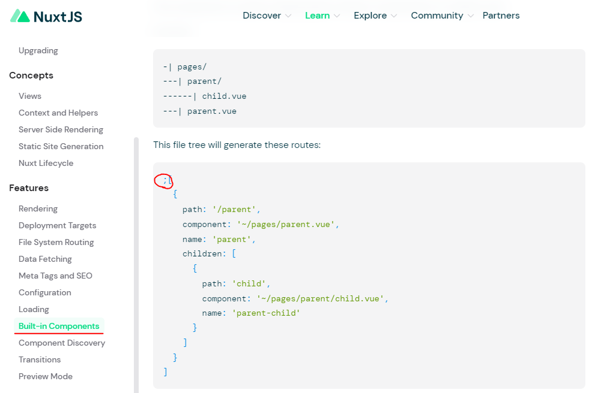
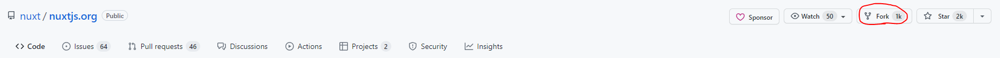
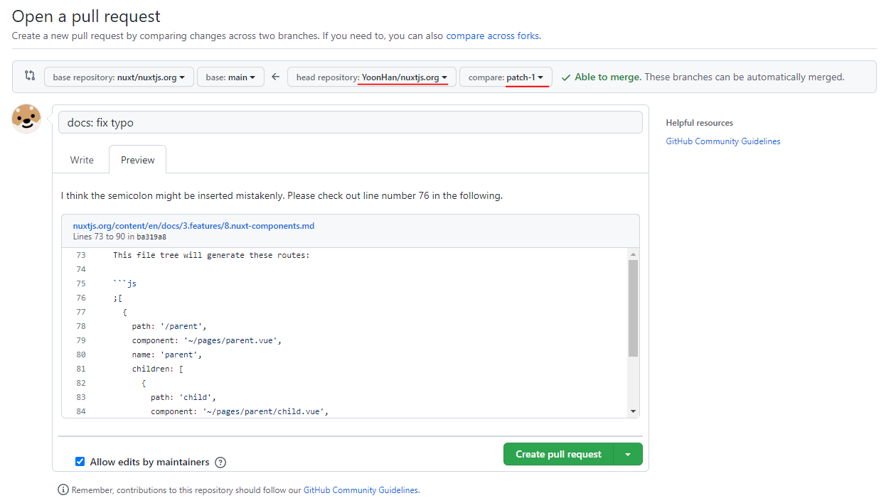

> `Nuxt.js` 의 공식 documentation 을 읽다가 오타를 발견하여 해당 오타를 수정한 뒤 Pull Request 를 날려보았다.

## Nuxt 공식 문서를 읽다가 세미콜론 오타를 발견

`Nuxt.js` 공식 문서를 읽다가 뜬금 세미콜론이 들어가 있는 부분이 눈에 띄었다.  
이걸 기회 삼아 오픈소스 프로젝트에 첫 PR을 날려보고자 시도를 했다.

## Repository fork 하기

우선, 오픈소스 repository에 직접 branch 를 따서 작업을 하면 안되므로 내 계정에다가 repository를 fork 해야 한다.  
위 스크린샷에서처럼 fork 버튼을 누르면 된다.  

그런 다음 적당한 이름의 branch 를 main 브랜치로부터 따서 작업을 진행하면 된다.  
나는 브랜치 이름을 `patch-1`로 정했다.

## Pull Request 생성하기

작업을 완료한 이후에는 위 스크린샷 처럼 Pull Request 를 생성해주었다.  
PR을 생성하는 방법은 repository 메뉴에서 `Pull Requests` 클릭 -> `New pull request` 버튼을 클릭해주면 된다.  
그리고나서 fork 했던 나의 레포지토리를 head repository 로 설정해주고 작업한 브랜치를 선택해주면 코드 상의 변경 사항을 확인할 수 있다. 

내용까지 잘 작성한 뒤 `Create pull request` 버튼을 클릭하면 PR 요청 완료!
semicolon 이 오타가 맞다면 해당 PR은 아마 nuxt:main branch에 merge 될 것이다ㅎㅎ

