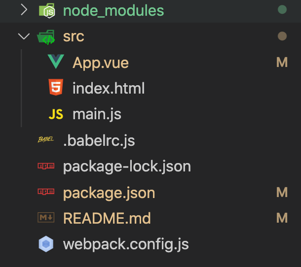
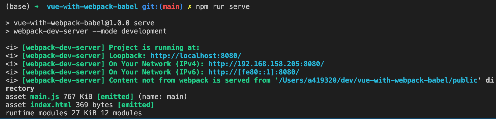
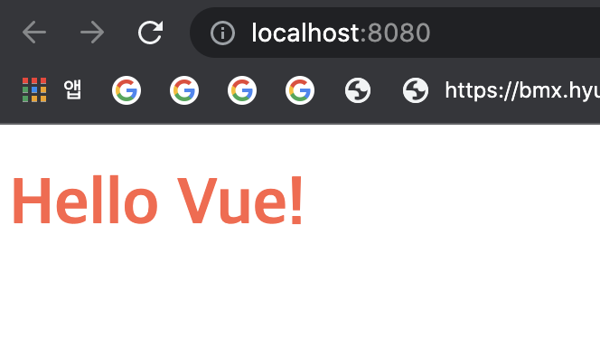

> React 개발 환경은 보통 **Create-React-App**, Vue 개발환경은 **Vue-CLI** 를 통해 자동으로 구성하는 경우가 많다.<br />
그런데 누군가 나에게 이러한 툴의 도움 없이 바닥부터 개발환경을 구성하라고 한다면, 자신있게 할 수 있다는 말이 나오지 않을 것 같아서 이번 기회에 공부를 해두려고 한다.<br />
Vue 3 개발환경을 webpack 과 babel 을 이용하여 처음부터 구성해보는 과정을 적어보았다.

## 왜 Webpack 환경을 직접 구성할 줄 알아야 할까?
여지껏 Vue 로 개발을 진행해오면서 Vue-CLI 의 도움을 받아 프로젝트를 구성했었다.<br />
그런데 이러한 방식의 편리함 이면에는 다음과 같은 문제가 있음을 얼마 전 알게 되었다. <br />

- Vue-CLI 에서 사용하는 Webpack 버전에 종속된다. (예를 들어 Vue-CLI 가 webpack 4 버전 기반이라면 webpack 5 버전의 feature는 사용하지 못한다) <br />
- Vue-CLI가 Webpack 관련 설정을 알아서 진행해주므로 개발자가 가진 Webpack 자체에 대한 이해도가 떨어질 수 있다. <br />

## Webpack 이란?
Webpack 은 모듈화된 Javascript 코드를 묶어 하나 이상의 덩어리로 만드는 작업을 해준다. 이 작업을 **번들링(bundling)** 이라고 한다. <br />
Entry 모듈에서부터 시작해 **Dependency Graph**를 그려나가는데, 이 Dependency Graph 란 간단히 말해서 Javascript 모듈 간 의존성을 표현하는 그래프를 말한다. <br />
예를 들면, 하나의 Javascript 모듈에서 다른 모듈을 import 하고 있다면 import 하는 모듈이 import 되는 모듈에 의존성을 가진다고 할 수 있다. <br />
Webpack의 핵심 구성요소는 **Entry**, **Output**, **Loaders**, **Plugins**, **Mode**, 그리고 **Browser Compatibility** 이다.

- Entry

  Webpack 이 Dependency Graph를 구성하기 위해 어디서부터 시작해야 할지를 알려주는 진입점이라고 보면 된다. <br />
  기본값은 **./src/index.js** 인데, config 파일을 통해 변경이 가능하다.

- Output

  생성된 덩어리(**번들**)파일을 내보낼 위치 및 파일의 이름을 지정할 수 있다.

- Loaders

  Webpack은 기본적으로 Javascript 나 JSON만 이해하도록 설계되었다. 그래서 CSS나 image 파일 같은 다른 리소스를 이해하게 만드려면 별도의 기능이 필요하다. <br />
  이 기능을 해주는 것이 바로 Loader 이다. Loader는 config 파일에서 설정해줄 수 있다.

- Plugins

  Loader가 Webpack이 이해할 수 없는 유형의 리소스들을 대신 처리해주는 역할을 한다면, <br />
  Plugin은 추가 기능을 더해주는 역할을 한다고 보면 된다. 번들링된 결과물을 최적화 해주는 기능이라든지 환경변수를 주입해준다든지 하는 확장 기능을 제공한다.

- Mode

  **Production**, **development**, **none** 세 값을 지정할 수 있다. 배포환경, 개발환경 별로 세팅을 다르게 가져갈 수 있다.

- Browser Compatibility

  Webpack은 ES5가 지원되는 모든 브라우저를 지원한다(IE8이하는 지원하지 않음).


## Babel 이란?
Javascript 용 컴파일러이다. 어떤 버전의 Javascript 코드를 특정 버전의 Javascript 코드로 변환해주는 툴이다. <br />
구형 브라우저는 최신 Javascript 문법을 지원하지 않으므로 이러한 브라우저를 지원하기 위해 만들어진 툴이다.


## 프로젝트 구성하기


폴더에 관한 설명은 다음과 같다.

- src

  **App.vue** 및 Webpack 의 Entry 가 될 **main.js**가 위치함. **index.html** 에는 App 컴포넌트가 mount 될 것이다.

이외에 **.babelrc.js** 는 babel 관련 config 파일이고, **webpack.config.js** 는 Webpack 관련 config 파일이다.

## 관련 라이브러리 설치 및 각 파일 내용 작성

**npm install -D vue vue-loader vue-template-compiler webpack webpack-cli webpack-dev-server babel-loader @babel/core @babel/preset-env css-loader vue-style-loader html-webpack-plugin**
명령어를 입력해서 라이브러리를 설치한다. <br />
꽤 많은 라이브러리에 의존성을 갖는데, 하나하나 살펴보면

- **vue** => Vue 코어
- **vue-loader** => Vue SFC(Single File Component) loader. **.vue** 확장자를 가진 파일을 webpack 이 인식할 수 있도록 해줌.
- **vue-template-compiler** => runtime 에서의 Vue template 컴파일 오버헤드를 줄이기 위해 pre-compile 을 수행. 아주 특별한 경우가 아니라면 vue-loader 와 함께 설치해야 한다.
- **vue-style-loader** => **.vue** 파일 안의 **`<style>`** 부분에 있는 CSS를 load 함.
- **webpack** => Webpack 코어.
- **webpack-cli** => Webpack cli 도구.
- **webpack-dev-server** => Webpack 개발 서버
- **babel-loader** => **.js**파일에 적용할 babel loader
- **`@babel/core`** 및 **`@babel/preset-env`** => 코드의 동작 자체에 영향을 미치진 않음. 하지만 babel을 적용하면 보다 넓은 브라우저 지원 범위를 가져갈 수 있음.
- **css-loader** => CSS 파일을 Webpack 이 인식할 수 있도록 해줌.
- **html-webpack-plugin** => **index.html** 파일을 가져와서 번들링 완료된 javascript 파일을 head 에 삽입해 준뒤, output 경로에 복사해준다.

<br />

이제 각 파일에 내용을 작성한다.

- src/App.vue

```javascript
/* src/App.vue */

<template>
  <div>
    <h1>{{message}}</h1>
  </div>
</template>

<script>
export default {
  data() {
    return {
      message: 'Hello Vue!',
    };
  },
};
</script>

<style>
#app {
  font-size: 18px;
  font-family: 'Roboto', sans-serif;
  color: tomato;
}
</style>
```

<br />

- src/main.js. 이 파일이 Webpack 의 entry 가 될 것이다.

```javascript
/* src/main.js */
import { createApp } from 'vue'
import App from './App.vue'

createApp(App)
  .mount('#app')
```

<br />


- public/index.html. Vue 컴포넌트가 div#app 요소에 렌더링 될 것이다.
```html
<!-- src/index.html -->
<!DOCTYPE html>
<html>
  <head>
    <meta charset="utf-8">
    <meta name="viewport" content="width=device-width, initial-scale=1.0">
    <title>Vue.js project from scratch with webpack + babel</title>
  </head>
  <body>
    <div id="app"></div>
    <script src="../dist/bundle.js" type="text/javascript"></script>
  </body>
</html>
```

<br />

- .babelrc.js (babel config 파일)
```
module.exports = {
// @babel/preset-env 는 javascript의 확정 스펙이 아닌 proposal 스펙까지 포함한 preset이다.
  presets: ['@babel/preset-env'],
}
```

## Webpack 설정하기
**webpack.config.js** 파일에 다음의 내용을 작성한다.

```javascript
const HtmlWebpackPlugin = require('html-webpack-plugin');
const { VueLoaderPlugin } = require('vue-loader');

module.exports = {
  // entry 포인트. 이 파일로부터 시작해 dependency graph 를 구성해 나간다.
  entry: './src/main.js',
  module: {
    rules: [
      // javscript transpile 용 babel loader 설정
      { test: /\.js$/, use: 'babel-loader' },
      { test: /\.vue$/, use: 'vue-loader' },
      // CSS 관련 loader 설정
      // vue-style-loader 는 '.vue' 파일 안의 <style> 블록 안의 CSS 를 처리하고
      // css-loader는 모든 '.css' 파일을 묶어 하나의 css 파일로 만들어준다.
      { test: /\.css$/, use: ['vue-style-loader', 'css-loader']},
    ]
  },
  // 플러그인 설정
  // VueLoaderPlugin 을 달아주어야 한다.
  // 이 플러그인은 위의 module.rules 에 정의한 규칙을 .vue 파일에도 그대로 적용할 수 있게 해준다.
  // ex) module.rules 에 /\.js$/ 와 매치되는 것이 있다면, 그것이 VueLoaderPlugin을 통해 .vue 파일의 <script> 영역에 적용된다.
  plugins: [
    new HtmlWebpackPlugin({
      template: './src/index.html',
    }),
    new VueLoaderPlugin(),
  ]
};
```

## Webpack 개발 서버 실행하기
이제 **package.json** 파일의 **scripts** 부분에 serve script 를 작성한 뒤
**npm run serve** 명령어로 개발 서버를 실행시켜본다.

```{1, 4, 5}
// package.json
{
  (...)
  "scripts": {
    "serve": "webpack-dev-server --mode development"
  },
  (...)
}
```

<br />

정상적으로 서버가 실행되었다면 다음과 비슷한 내용이 콘솔창에 출력될 것이고,


서버가 띄워진 주소로 접속하면 결과를 확인할 수 있다.



## HMR(Hot Module Replacement) 기능 추가하기

지금의 설정만으로 개발을 진행했을 때, 브라우저 새로고침시 기존 상태를 보존하면서 바뀐 부분만 교체(Module Replacement)할 수가 없다. <br />
새로고침을 하면 무조건 새롭게 스크립트가 로드되고 모든 화면이 다시 렌더링 된다.(기존 상태를 잃는다). <br />
이를 방지하기 위해 HMR 플러그인을 추가해본다.

**webpack.config.js** 파일에 하이라이트된 코드 줄을 추가한다. Webpack은 자체적으로 HMR 플러그인을 제공하고 있다.
```javascript{3, 28-29}
const HtmlWebpackPlugin = require('html-webpack-plugin');
const { VueLoaderPlugin } = require('vue-loader');
const webpack = require('webpack');

module.exports = {
  // entry 포인트. 이 파일로부터 시작해 dependency graph 를 구성해 나간다.
  entry: './src/main.js',
  module: {
    rules: [
      // javscript transpile 용 babel loader 설정
      { test: /\.js$/, use: 'babel-loader' },
      { test: /\.vue$/, use: 'vue-loader' },
      // CSS 관련 loader 설정
      // vue-style-loader 는 '.vue' 파일 안의 <style> 블록 안의 CSS 를 처리하고
      // css-loader는 모든 '.css' 파일을 묶어 하나의 css 파일로 만들어준다.
      { test: /\.css$/, use: ['vue-style-loader', 'css-loader']},
    ]
  },
  // 플러그인 설정
  // VueLoaderPlugin 을 달아주어야 한다.
  // 이 플러그인은 위의 module.rules 에 정의한 규칙을 .vue 파일에도 그대로 적용할 수 있게 해준다.
  // ex) module.rules 에 /\.js$/ 와 매치되는 것이 있다면, 그것이 VueLoaderPlugin을 통해 .vue 파일의 <script> 영역에 적용된다.
  plugins: [
    new HtmlWebpackPlugin({
      template: './src/index.html',
    }),
    new VueLoaderPlugin(),
    // Webpack HMR 플러그인
    new webpack.HotModuleReplacementPlugin()
  ]
};
```

## 결론
직접 webpack 구성을 해보니 번거롭다는 느낌이 드는 것은 여전하다.~~(vue-cli 로 편하게 구성하고 싶다ㅋㅋㅋ)~~
Vue 3 에 Webpack 5 를 설정할 때에는 큰 문제 없이 진행이 되었는데, Vue 2 와 Webpack 5 의 경우에는 호환성 이슈가 있는 듯 했다. <br />
예전에도 webpack, webpack-cli, webpack-dev-server 간 버전을 하나하나 맞추지 않으면 제대로 웹팩이 동작하지 않는 문제 때문에 골치가 아팠던 적이 있는데 혹시나 버전 문제가 있다면 구글링을 해서 세심하게 버전들을 맞춰줘야 한다..


## References
- [Webpack](https://webpack.js.org/concepts/)
- [[Vue] 개발환경 만들기 (without vue-cli)](https://velog.io/@kyusung/Vue-app-sfc-without-vue-cli)

